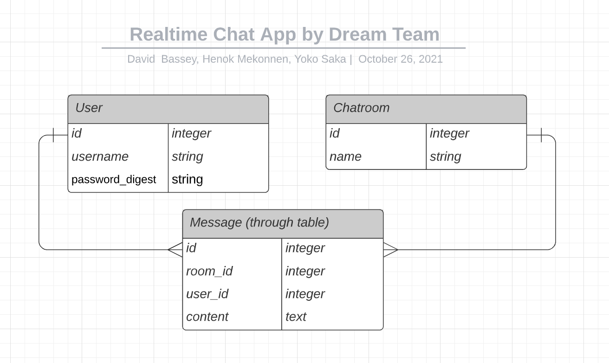

# Real Time Chat API built with Ruby on Rails

## About the Project

This API was built with Ruby on Rails for using on Real Time Chat App.
It uses Postgresql as the database.

- The database has 3 tables and models: User, Chatroom, Message
  - Users table has 'username' and 'password' columns
  - Chatrooms has 'name' column
  - Messages table is a through table having user_id, chatroom_id, and content columns
  <!-- - To authorize users, this app uses [JWT](https://jwt.io/) and [Rack-cors](https://github.com/cyu/rack-cors) -->

A list of commonly used resources that I find helpful is listed in the acknowledgments.

## Built With

- [Ruby on Rails](https://rubyonrails.org/)
- [Ruby](https://www.ruby-lang.org/en/)

## Live Demo

[Live Link](https://chat-app-api-dreamteam.herokuapp.com/)

## Getting Started

To get a local copy up and running follow these simple example steps.

1. On the project GitHub page, navigate to the main page of the repository.
2. Under the repository name, locate and click on a green button named `Code`.
3. Copy the project URL as displayed.
4. If you're running the Windows Operating System, open your command prompt. On Linux, Open your terminal.
5. Change the current working directory to the location where you want the cloned directory to be made. Leave as it is if the current location is where you want the project to be.
6. Type git clone, and then paste the URL you copied in Step 3.  
   e.g. $ git clone https://github.com/yourUsername/yourProjectName
7. Press Enter. Your local copy will be created.
8. To install all dependencies and necessary gems, run `bundle install`
9. Run `rails db:setup`
10. Run `rails server` to run rails application in your local server
11. Run `rspec` to run rspec tests

## How to allow the frontend app to interact with this API

1. Go to puma.rb in config/initializers, and rewrite the port from 3000 to 3001 like below:
   e.g. `port ENV.fetch("PORT") { 3001 }`

2. Go to cors.rb in config/initializers, and rewrite the origins path for your frontend path in both local and production

<!-- ## Authentication

- To manage records and items, it needs to log in with a username and a password. Then, you need to include a token, which is issued and passed by logged in, in the header when interacting with this API like below:
`headers: {
  'Content-Type': 'application/json',
  Authorization: `Bearer ${token}`,
},`
- Plus, to manage items, it needs to log in with the user account with the admin: true
 -->

## Entity relationship diagam(ERD)

## Author

👤 **Henok Mossissa**

- GitHub: [@henatan99](https://github.com/henatan99)
- Twitter: [@henatan99](https://twitter.com/henatan99)
- LinkedIn: [Henok Mossissa](https://www.linkedin.com/in/henok-mekonnen-2a251613/)

👤 **David Bassey**

- GitHub: [@davidosky007](https://github.com/davidosky007)
- Twitter: [@davidosky2](https://twitter.com/Davidosky2)
- LinkedIn: [David Bassey](https://www.linkedin.com/in/david-bassey-akan/)

👤 **Yoko Saka**

- GitHub: [@yocosaka](https://github.com/yocosaka)
- Twitter: [@yocosaka](https://twitter.com/yocosaka)
- LinkedIn: [Yoko Saka](https://www.linkedin.com/in/yokosaka)

## Contributing

Contributions, issues, and feature requests are welcome!
Feel free to check the [issues page](../../issues).

1. Fork the Project
2. Create your Feature Branch (`git checkout -b feature/AmazingFeature`)
3. Commit your Changes (`git commit -m 'Add some AmazingFeature'`)
4. Push to the Branch (`git push origin feature/AmazingFeature`)
5. Open a Pull Request

## Show your support

Give a ⭐️ if you like this project!

## License

This project is [MIT](./LICENSE) licensed.

## Acknowledgements

- [Ruby on Rails guide](https://guides.rubyonrails.org/api_documentation_guidelines.html)
- [Arctile in CloudBees](https://www.cloudbees.com/blog/producing-documentation-for-your-rails-api/)
- [JWT](https://jwt.io/)
- [Rack-cors](https://github.com/cyu/rack-cors)
- [Bcrypt](https://github.com/kelektiv/node.bcrypt.js#readme)
- [Shoulda-matchers](https://github.com/thoughtbot/shoulda-matchers)
- [Rspec-rails](https://github.com/rspec/rspec-rails)
